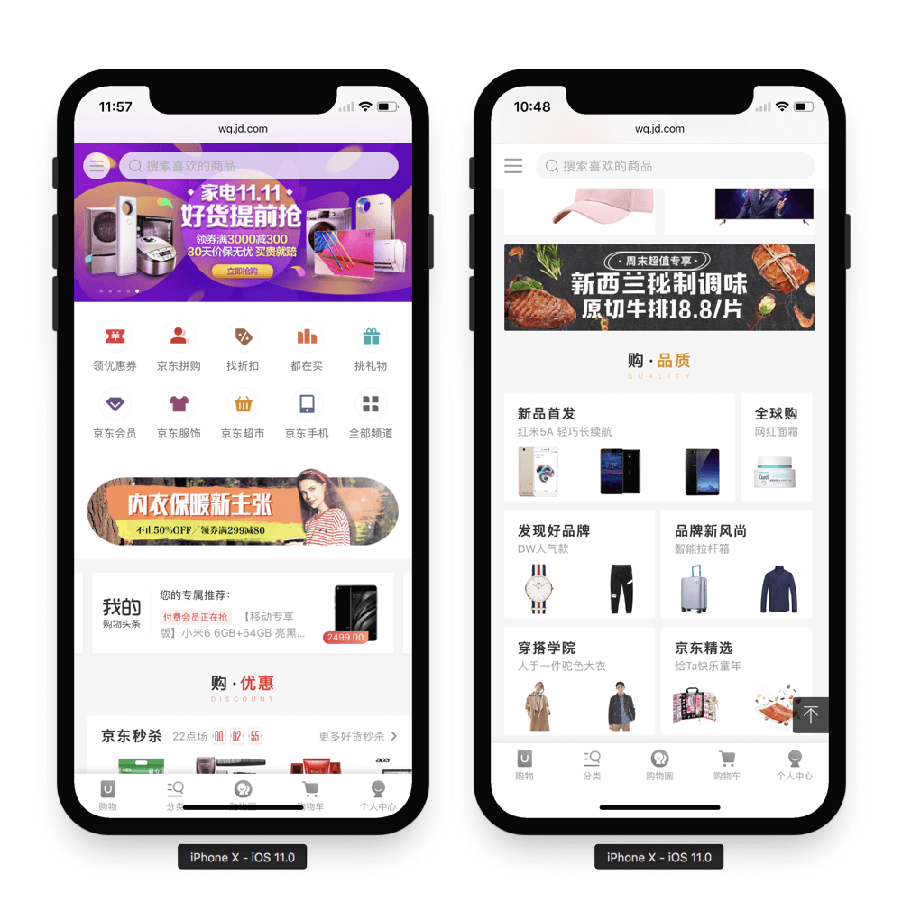

# 针对 iPhone X 的 H5 适配

> iPhoneX 取消了物理按键，改成底部小黑条，这一改动导致网页出现了比较尴尬的屏幕适配问题。对于网页而言，顶部（刘海部位）的适配问题浏览器已经做了处理，所以我们只需要关注底部与小黑条的适配问题即可（即常见的吸底导航、返回顶部等各种相对底部 fixed 定位的元素）,以下就是适配前后的效果对比图

#### 安全区域

> 安全区域指的是一个可视窗口范围，处于安全区域的内容不受圆角（corners）、齐刘海（sensor housing）、小黑条（Home Indicator）影响，如下图蓝色区域：

> **我们要做好适配，必须保证页面可视、可操作区域是在安全区域内**
